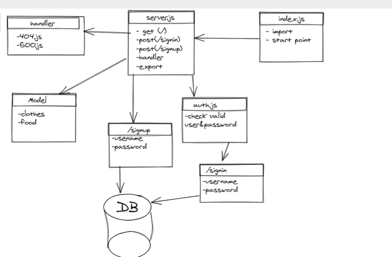

# basic-auth

## LAB - 06

### Deployment Test


- [ci/cd GitHub Actions](https://github.com/MohammadAljadayh/basic-auth/actions).
- [herokuapp Link Main ](https://mohammadbasicauth.herokuapp.com/).
-[PULL_REQUEST ](https://github.com/MohammadAljadayh/basic-auth/pull/1).
- [PULL_REQUEST ](https://github.com/MohammadAljadayh/basic-auth/pull/2).
- [Main Repo link](https://github.com/MohammadAljadayh/basic-auth).

### Setup 

`.env` **requirements**

- `PORT` - 3000

- `DATABASE_URL` = Postgres DB

**Running the app**

- `npm start`

- Endpoint: `/signup`
```
 { 
    "username": "root" ,
     "password": "root" 
     
     }
```
- Returns : 
```
{
    "id": 2,
    "username": "root",
    "password": "$2b$10$crd318T2i747Lph8kGGwO.W8X4/YKkWhzPSfWjI/7jlRVpAe9QDfa",
    "updatedAt": "2021-11-07T15:31:59.924Z",
    "createdAt": "2021-11-07T15:31:59.924Z"

```
- Endpoint: `/signin`

> Username `root`
> Password `root`

- Returns 
```
{
    "id": 2,
    "username": "root",
    "password": "$2b$10$crd318T2i747Lph8kGGwO.W8X4/YKkWhzPSfWjI/7jlRVpAe9QDfa",
    "createdAt": "2021-11-07T15:31:59.924Z",
    "updatedAt": "2021-11-07T15:31:59.924Z"
}
```
**Tests**

- Unit Tests: `npm run test`
- Lint Tests: `npm run lint`


